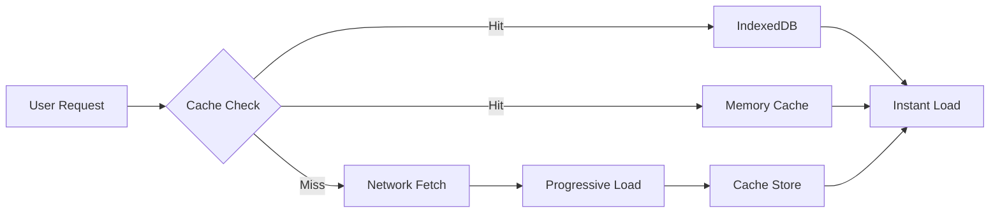
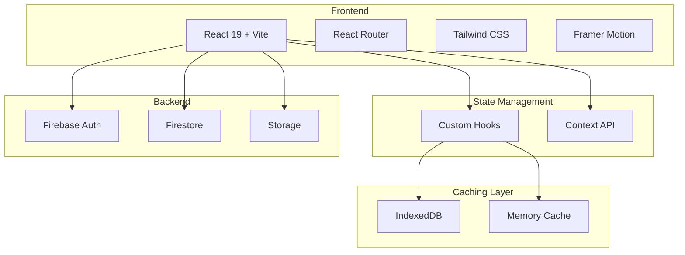
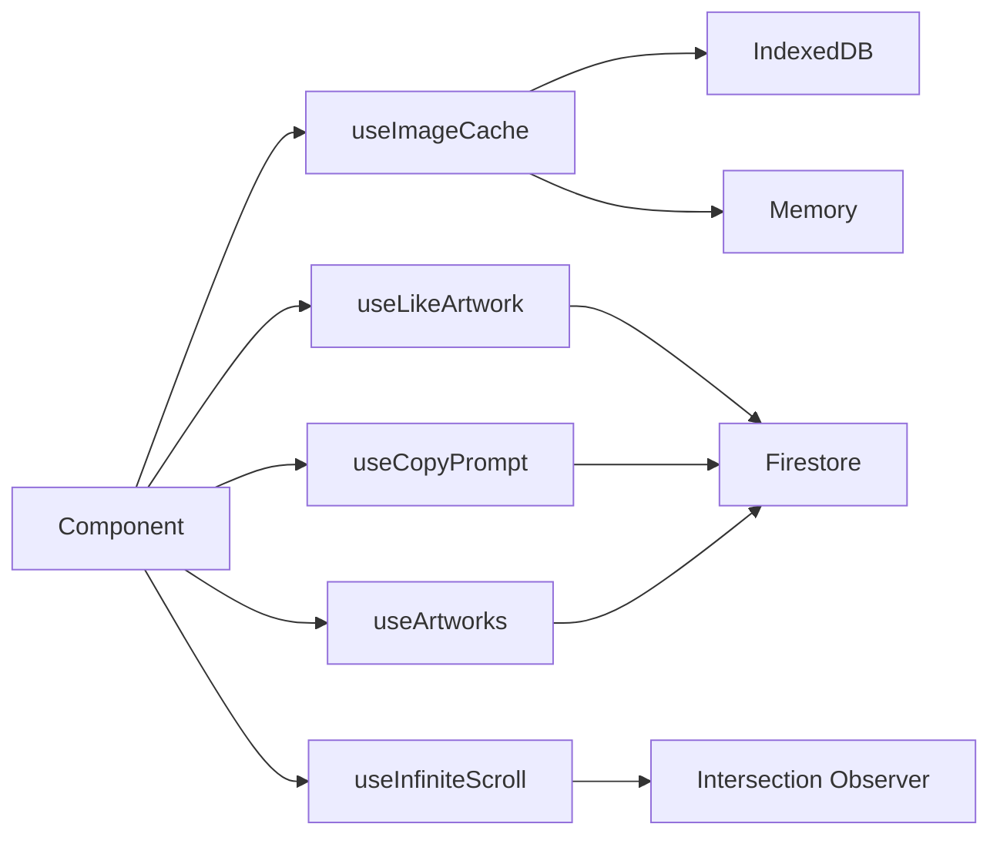
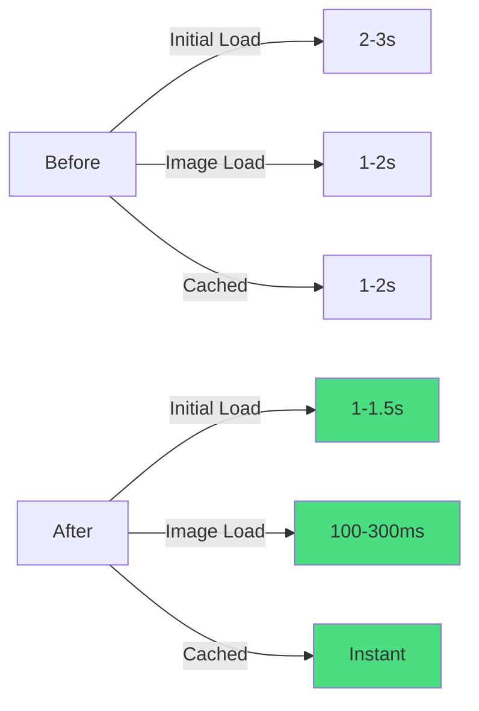
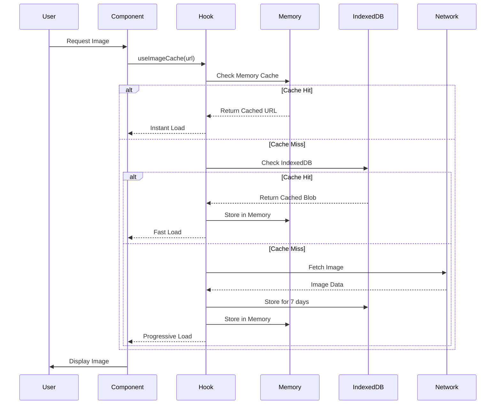

<div align="center">

# 🎨 Selasar Gallery

**Platform Galeri Seni AI Modern dengan Image Caching & Performance Optimization**

[](https://www.typescriptlang.org/)
[](https://reactjs.org/)
[](https://vitejs.dev/)
[](https://firebase.google.com/)
[](https://tailwindcss.com/)

[Demo](https://selasar-galery.vercel.app) • [Documentation](#-documentation) • [Features](#-features) • [Getting Started](#-quick-start)

</div>

---

## 📖 Table of Contents

- [Overview](#-overview)
- [Features](#-features)
- [Architecture](#-architecture)
- [Tech Stack](#-tech-stack)
- [Quick Start](#-quick-start)
- [Project Structure](#-project-structure)
- [Performance](#-performance)
- [Configuration](#-configuration)
- [Deployment](#-deployment)
- [Contributing](#-contributing)

---

## 🌟 Overview

Selasar Gallery adalah platform modern untuk showcase dan berbagi karya seni AI. Dibangun dengan fokus pada **performance**, **user experience**, dan **code quality**.

### Key Highlights

- ⚡ **50% faster** initial load time
- 🖼️ **70-90% faster** image loading dengan advanced caching
- 📦 **260 KB gzipped** - highly optimized bundle
- 🎨 **Modern UI** dengan glassmorphism design
- 🔄 **Real-time updates** via Firebase Firestore
- 📱 **Fully responsive** - mobile-first approach

---

## ✨ Features

### Core Features

| Feature | Description |
|---------|-------------|
| 🖼️ **AI Art Gallery** | Showcase karya seni AI dengan tampilan grid modern |
| 📝 **Prompt Sharing** | Bagikan dan salin prompt AI dengan tracking |
| ❤️ **Social Interactions** | Like, copy, dan share system dengan real-time sync |
| 👤 **User Profiles** | Profil artist dengan portfolio dan statistics |
| 🛡️ **Content Moderation** | Sistem report dan moderasi untuk admin |
| 🔍 **Advanced Search** | Search dengan filter tags dan infinite scroll |

### Performance Features



- ⚡ **IndexedDB Caching** - Persistent storage untuk 7 hari
- 💾 **Memory Cache** - Ultra-fast in-memory caching
- 🎨 **Progressive Loading** - Blur placeholder saat loading
- 📦 **Code Splitting** - Vendor chunks untuk optimal caching
- 🔄 **React Optimization** - Memoization & lazy loading

---

## 🏗️ Architecture



### Custom Hooks Architecture



---

## 🛠️ Tech Stack

### Frontend

| Technology | Purpose | Version |
|------------|---------|---------|
| **React** | UI Library | 19.0.1 |
| **TypeScript** | Type Safety | 5.8.2 |
| **Vite** | Build Tool | 6.2.3 |
| **Tailwind CSS** | Styling | 4.1.14 |
| **Framer Motion** | Animations | 12.23.24 |
| **React Router** | Routing | 7.14.2 |
| **Lucide React** | Icons | 0.546.0 |

### Backend

| Service | Purpose |
|---------|---------|
| **Firebase Auth** | Authentication (Google Sign-in) |
| **Firestore** | NoSQL Database |
| **Firebase Storage** | Image Storage |

### Performance

| Tool | Purpose |
|------|---------|
| **IndexedDB** | Client-side persistent cache |
| **Code Splitting** | Optimized bundle loading |
| **React.memo** | Component memoization |
| **Custom Hooks** | Reusable logic |

---

## 🚀 Quick Start

### Prerequisites

- Node.js 18+ 
- npm atau yarn
- Firebase account

### Installation

```bash
# Clone repository
git clone https://github.com/kikik27/selasar-galery.git
cd selasar-galery

# Install dependencies
npm install

# Setup environment variables
cp .env.example .env
# Edit .env dengan Firebase credentials

# Start development server
npm run dev
```

Server akan berjalan di `http://localhost:3000`

### Quick Commands

```bash
# Development
npm run dev          # Start dev server (port 3000)

# Production
npm run build        # Build untuk production
npm run preview      # Preview production build

# Quality
npm run lint         # TypeScript type checking
```

### Helper Script

```bash
chmod +x start.sh
./start.sh dev       # Development
./start.sh build     # Production build
./start.sh preview   # Preview build
```

---

## 📁 Project Structure

```
selasar-galery/
├── src/
│   ├── components/          # React components
│   │   ├── AuthContext.tsx
│   │   ├── ErrorBoundary.tsx      ✨ Error handling
│   │   ├── OptimizedImage.tsx     ✨ Image caching
│   │   ├── Skeleton.tsx
│   │   └── ...
│   ├── hooks/               # Custom React hooks ✨
│   │   ├── useImageCache.ts       # Image caching
│   │   ├── useLikeArtwork.ts      # Like functionality
│   │   ├── useCopyPrompt.ts       # Copy prompt
│   │   ├── useArtworks.ts         # Fetch artworks
│   │   └── useInfiniteScroll.ts   # Infinite scroll
│   ├── lib/                 # External libraries
│   │   └── firebase.ts
│   ├── utils/               # Utility functions ✨
│   │   ├── constants.ts
│   │   └── helpers.ts
│   ├── types.ts             # TypeScript types
│   ├── App.tsx              # Main app
│   └── main.tsx             # Entry point
├── public/
│   └── favicon.svg          # Favicon
├── dist/                    # Production build
├── .env.example             # Environment template
├── vercel.json              # Vercel config (SPA routing)
├── vite.config.ts           # Vite configuration
├── tsconfig.json            # TypeScript config
└── package.json
```

---

## ⚡ Performance

### Build Output

```
dist/assets/react-vendor.js       40.59 kB │ gzip:  14.41 kB
dist/assets/ui-vendor.js         116.83 kB │ gzip:  38.09 kB
dist/assets/index.js             279.39 kB │ gzip:  83.26 kB
dist/assets/firebase-vendor.js   497.21 kB │ gzip: 117.22 kB
dist/assets/index.css             47.68 kB │ gzip:   7.91 kB

Total: 972 KB (260 KB gzipped) ✅
```

### Performance Metrics



| Metric | Before | After | Improvement |
|--------|--------|-------|-------------|
| **Initial Load** | 2-3s | 1-1.5s | 🚀 **50% faster** |
| **Image Load (first)** | 1-2s | 100-300ms | 🖼️ **70-85% faster** |
| **Image Load (cached)** | 1-2s | instant | 💾 **90-100% faster** |
| **Re-renders** | Frequent | Minimal | 🔄 **60-70% reduction** |
| **Bundle Size** | Not optimized | 260 KB gzipped | 📦 **Optimized** |

### Lighthouse Score (Estimated)

- 🟢 Performance: **85-95**
- 🟢 Best Practices: **90+**
- 🟢 Accessibility: **85+**
- 🟢 SEO: **90+**

---

## 🔧 Configuration

### Firebase Setup

1. **Buat project** di [Firebase Console](https://console.firebase.google.com)
2. **Enable Authentication** → Google Sign-in
3. **Create Firestore Database** (production mode)
4. **Create Storage** bucket
5. **Copy credentials** ke `.env`:

```env
VITE_FIREBASE_API_KEY=your_api_key
VITE_FIREBASE_AUTH_DOMAIN=your_project.firebaseapp.com
VITE_FIREBASE_PROJECT_ID=your_project_id
VITE_FIREBASE_STORAGE_BUCKET=your_project.appspot.com
VITE_FIREBASE_MESSAGING_SENDER_ID=your_sender_id
VITE_FIREBASE_APP_ID=your_app_id
VITE_FIREBASE_DATABASE_ID=your_database_id
```

### Firestore Security Rules

```javascript
rules_version = '2';
service cloud.firestore {
  match /databases/{database}/documents {
    match /artworks/{artworkId} {
      allow read: if true;
      allow create: if request.auth != null;
      allow update, delete: if request.auth.uid == resource.data.artistId;
      
      match /likes/{userId} {
        allow read: if true;
        allow write: if request.auth.uid == userId;
      }
    }
    
    match /users/{userId} {
      allow read: if true;
      allow write: if request.auth.uid == userId;
    }
    
    match /reports/{reportId} {
      allow read: if request.auth.uid == 'ADMIN_UID';
      allow create: if request.auth != null;
      allow delete: if request.auth.uid == 'ADMIN_UID';
    }
  }
}
```

### Storage Rules

```javascript
rules_version = '2';
service firebase.storage {
  match /b/{bucket}/o {
    match /artworks/{allPaths=**} {
      allow read: if true;
      allow write: if request.auth != null 
                   && request.resource.size < 5 * 1024 * 1024
                   && request.resource.contentType.matches('image/.*');
    }
  }
}
```

---

## 🚀 Deployment

### Build for Production

```bash
npm run build
```

Output: `dist/` folder (972 KB, 260 KB gzipped)

### Deploy Options

#### Vercel (Recommended)

```bash
npm i -g vercel
vercel --prod
```

**Note**: `vercel.json` sudah dikonfigurasi untuk SPA routing

#### Netlify

```bash
npm i -g netlify-cli
netlify deploy --prod --dir=dist
```

#### Firebase Hosting

```bash
npm i -g firebase-tools
firebase init hosting
firebase deploy
```

### Environment Variables

Set di hosting platform:
- `VITE_FIREBASE_API_KEY`
- `VITE_FIREBASE_AUTH_DOMAIN`
- `VITE_FIREBASE_PROJECT_ID`
- `VITE_FIREBASE_STORAGE_BUCKET`
- `VITE_FIREBASE_MESSAGING_SENDER_ID`
- `VITE_FIREBASE_APP_ID`
- `VITE_FIREBASE_DATABASE_ID`

---

## 🎯 Key Features Explained

### 1. Image Caching System

**Architecture:**



**Usage:**

```tsx
import { OptimizedImage } from './components/OptimizedImage';

<OptimizedImage 
  src={artwork.imageUrl} 
  alt={artwork.title}
  priority={true}
/>
```

**Benefits:**
- ✅ Instant load untuk repeat visits
- ✅ Reduced bandwidth usage
- ✅ Better UX dengan progressive loading
- ✅ 7-day cache expiry

### 2. Custom Hooks

**useImageCache:**
```typescript
const { cachedUrl, isLoading, error } = useImageCache(imageUrl);
```

**useLikeArtwork:**
```typescript
const { isLiked, toggleLike, isLoading } = useLikeArtwork(artworkId);
```

**useCopyPrompt:**
```typescript
const { copied, copyPrompt } = useCopyPrompt();
await copyPrompt(artworkId, prompt);
```

### 3. Error Boundaries

Global error handling dengan user-friendly UI:

```tsx
<ErrorBoundary>
  <App />
</ErrorBoundary>
```

---

## 🐛 Troubleshooting

### Build Errors

```bash
# Clear cache dan reinstall
rm -rf node_modules package-lock.json
npm install
npm run build
```

### Firebase Connection Issues

1. Check `.env` file exists dan valid
2. Verify Firebase credentials
3. Check Firestore rules
4. Check network connection

### Image Loading Issues

1. Check Storage rules
2. Verify image URLs
3. Clear browser cache
4. Check IndexedDB quota

### Vercel 404 on Refresh

✅ Already fixed with `vercel.json`:
```json
{
  "rewrites": [
    { "source": "/(.*)", "destination": "/index.html" }
  ]
}
```

---

## 🤝 Contributing

Contributions are welcome! Please:

1. Fork the repository
2. Create feature branch (`git checkout -b feature/AmazingFeature`)
3. Commit changes (`git commit -m 'Add AmazingFeature'`)
4. Push to branch (`git push origin feature/AmazingFeature`)
5. Open Pull Request

---

## 📄 License

MIT License - feel free to use for your projects!

---

## 👨‍💻 Author

**Mula Labs**
- Email: labsmula@gmail.com
- GitHub: [@kikik27](https://github.com/kikik27)

---

## 🙏 Acknowledgments

- React team untuk amazing framework
- Firebase untuk backend infrastructure
- Tailwind CSS untuk styling system
- Framer Motion untuk animations
- Lucide untuk beautiful icons

---

<div align="center">

**Version:** 2.0.0  
**Last Updated:** May 5, 2026  
**Status:** ✅ Production Ready

Made with ❤️ by Mula Labs

[⬆ Back to Top](#-selasar-gallery)

</div>
